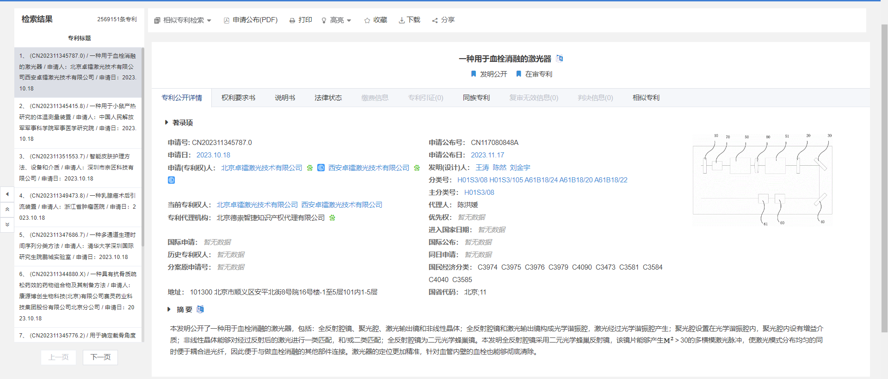
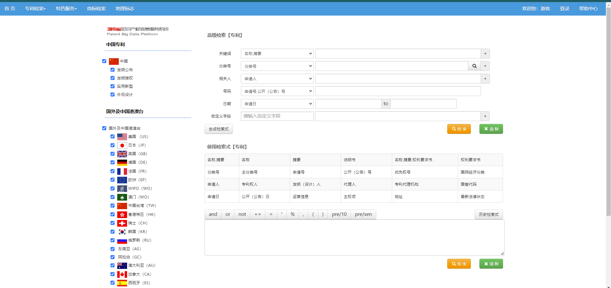

## 1、生物药包含的药品、医疗器械范围

### 1.1 生物岛公司技术

<http://www.bbpip.com/science>
    

## 2、数据来源

#### 2.1 国家知识产权局

[中国专利公布公告](https://www.cnipa.gov.cn/col/col1510/index.html)

可以通过分类号关键字 A61 查询出于医学相关的专利

<http://epub.cnipa.gov.cn/Dxb/IndexPDQuery>

#### 2.2 [国家科技图书文献中心](https://www.nstl.gov.cn/search_advanced.html?nt=Patent)

#### 2.3 [北京知识产权公共信息服务平台](https://www.beijingip.cn/jopm_ww/loginedPage/web2/onlineSearch/zljsindex.jsp)

A61分类数据量 10041197 （查询结果分类不准）

省级包含国家知识产权局没有的数据：权利要求、说明书、同族专利、法律状态、引证信息、专利状态

##### 2.3.1 可找到的记录

[示例 CN115645071A](https://search.beijingip.cn/search/detail/index?d=CN202211382768@CN115645071A@20230131&s=IPC=A61)

###### 北京知识产权局信息展示

###### 国家知识产权局信息展示

##### 2.3.1 未找到的记录

### 2.4 [广东省知识产权公共信息综合服务平台](https://search.gpic.gd.cn/search-gpic/pldb/route/hostingplatform/search/searchForm)

A61 查询结果，两百万条左右；需要登录方可查看专利详情

省级包含国家知识产权局没有的数据：权利要求、说明书、同族专利、法律状态、引证信息、专利状态、专利分类

示例 CN202311345787.0

### 2.4 [湖南省知识产权公共信息服务系统](http://pat.hnipo.net:8088/zlgaoji.do)

省级包含国家知识产权局没有的数据：权利要求、说明书、同族专利、法律状态、引证信息、专利状态

[示例 CN102389324B](http://pat.hnipo.net:8088/patentdetail.jsp)

### 总结

* 省级知识产权局的数据字段比国家级的多，包括 权利要求、说明书、同族专利、法律状态、引证信息、专利状态 等
* 省级中有许多国外专利，在国家局中找不到
* 各个地方级的知识产权局有大量专利信息，百万级以上

## 3、如何提取目标数据

* 找出各个地方级知识产权局网站，抓取数据
* 根据 IPC 的分类表中 A61 作为查询关键字，仅获取医学相关内容
* 每个数据均有分类码（号），可根据具体需求，进一步明确子分类，筛选数据

[2024.01版IPC分类表-A部.pdf](https://www.cnipa.gov.cn/module/download/downfile.jsp?classid=0&showname=2024.01%E7%89%88IPC%E5%88%86%E7%B1%BB%E8%A1%A8-A%E9%83%A8.pdf&filename=161b0c591e78477098b120848d37eb5e.pdf)

## 4、采集

### 4.1 各网站采集难易程度
### 4.2 采集频率

## 7、专利分类

